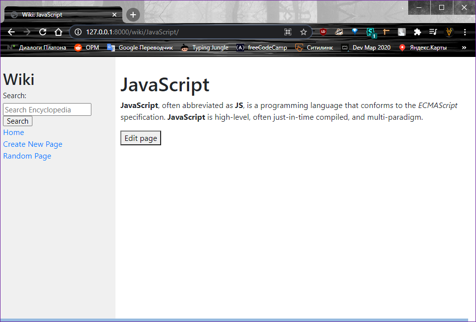
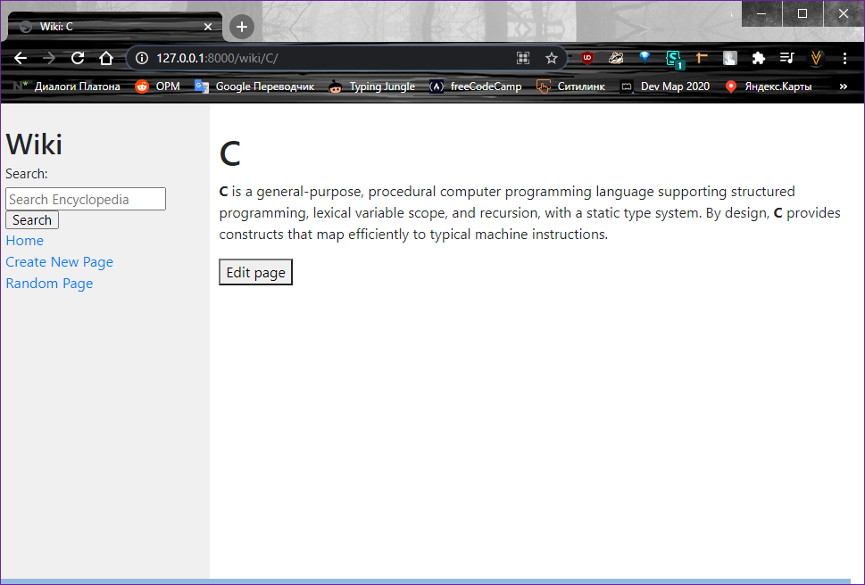
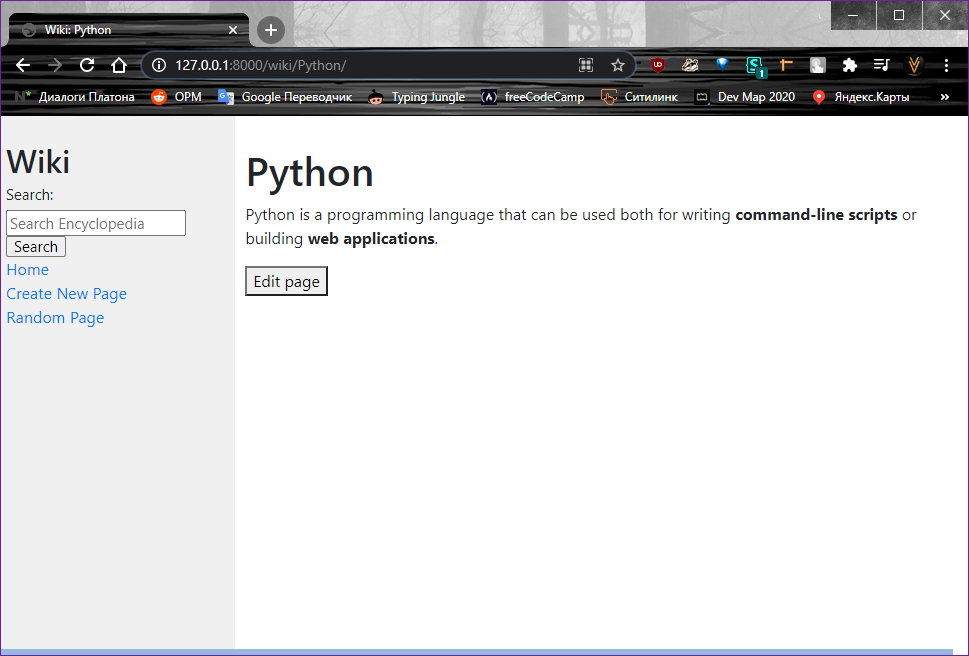

# Wikipedia-like online encyclopedia
Pages are written on the [Markdown2](https://github.com/trentm/python-markdown2), upgraded version of the [Markdown](https://en.wikipedia.org/wiki/Markdown)

### Entry pages:
Each page has it's own url at /wiki/__*TITLE*__ where __*TITLE*__ is the title of an encyclopedia entry.

And if page doesn't exist the user will be presented with an error page

